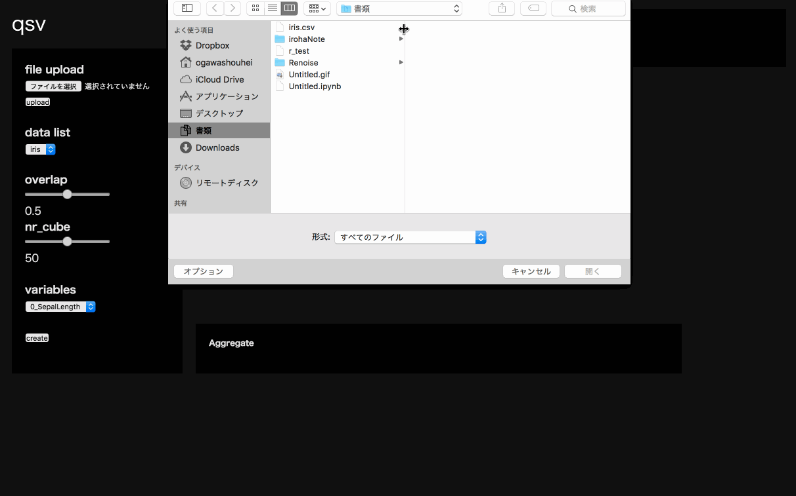

qsv
====

## Description
This application is data structure visualizer by topological data analysis method.

This softwear is using [kepler-mapper](https://github.com/MLWave/kepler-mapper).

## Demo

## Requirement
* Python 2.7+
* pandas
* flask
* gevent
* numpy
* scikit-learn

## Usage

`$ python app.py`

## Licence

[MIT](license.txt)

## Author
Shohei Ogawa